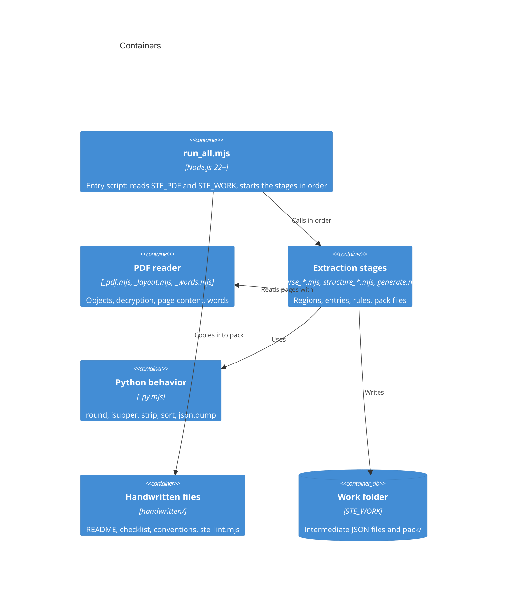

# Architecture

## Containers

The kit uses only the built-in modules of Node.js: `node:fs`, `node:path`, `node:zlib`, `node:crypto`, and `node:url`. The kit has no `package.json` and no packages to install.

## Pipeline

- First, `runAll` in `run_all.mjs` opens the PDF with `PdfDocument` from `extract/_pdf.mjs`. See [Pack build](flows/pack-build.md).
- `pageObjects` in `extract/_layout.mjs` and `extractWords` in `extract/_words.mjs` give the stages the data of each page. See [PDF read](flows/pdf-read.md).
- `parseDict` in `extract/parse_dict.mjs` and `structureDict` in `extract/structure_dict.mjs` make the dictionary entries. See [Dictionary extraction](flows/dictionary-extraction.md).
- `parseRules` in `extract/parse_rules.mjs` and `structureRules` in `extract/structure_rules.mjs` make the rules. See [Rules extraction](flows/rules-extraction.md).
- `generate` in `extract/generate.mjs` writes the pack files. See [Pack generation](flows/pack-generation.md).
- Last, `runAll` in `run_all.mjs` copies the handwritten files and the linter `ste_lint.mjs` into the pack. See [Pack linter](flows/lint.md).

## Invariants

- The output is the same each time and on each operating system. The stages sort with stable sorts, `cmpCodePoint` in `extract/_py.mjs` sorts strings by code point, and all text files use LF. `.gitattributes` keeps the handwritten files at LF in each checkout, because `runAll` copies them without a change.
- The stages give the same output as the Python kit, apart from the differences in `tests/PARITY.md`. `pyRound`, `isUpper`, `strip`, and `dumps` in `extract/_py.mjs` copy the Python behavior that the output uses.
- The repository contains no text from the specification. The tests in `tests/unit/` use invented pages that `buildDoc` in `tests/helpers/mkpdf.mjs` makes.
- The kit does not start Python. Only the tools in `tests/tools/` use Python, and only to compare the kit with the Python kit and with pdfplumber.

## Tests

- `node --test "tests/unit/*.test.mjs"` starts the unit tests. They do not use a PDF or Python.
- `tests/PARITY.md` tells how we compared the kit with the Python kit. It also gives each intended difference.
- [Testing](testing.md) tells how to run the tests and the tools that compare the kit with the Python kit.

## Where to go next

- [Flows](flows/index.md) for the end-to-end paths.
- [Decisions](decisions/index.md) for why the shape is what it is.
