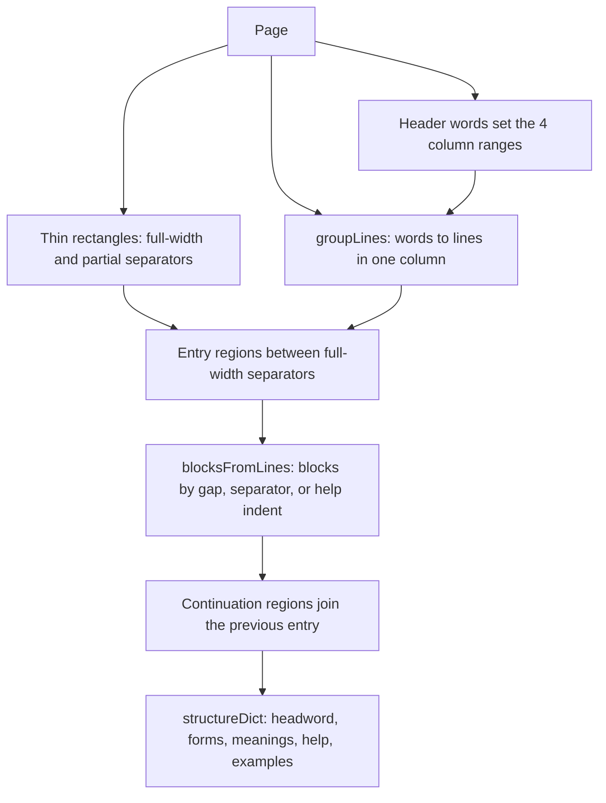

# Dictionary extraction

## Purpose

Part 2 of the specification is a table with 4 columns. The columns are the word, the approved meaning or the alternatives, STE examples, and examples that are not STE. This flow finds each entry on each page and connects an entry that continues on the next page. Then it gives each entry its word forms, meanings, help text, and examples.

## Entry points

- `parseDict` in `extract/parse_dict.mjs` reads the pages from `FIRST` = 149 to `LAST` = 434 and gives the entry regions. `run` in `parse_dict.mjs` writes them to `dict_raw.json`.
- `structureDict` in `extract/structure_dict.mjs` makes the entries. `run` in `structure_dict.mjs` writes them to `dict_entries.json`.

## Sequence

## Key behavior

- `parseDict` in `extract/parse_dict.mjs` reads the x positions of the header words `Word`, `Approved`, `STE`, and `Non-STE` on each page. The left pages and the right pages have different margins, so the columns come from each page.
- `parseDict` in `parse_dict.mjs` uses only the body of the page, between `BODY_TOP` = 89 and `BODY_BOTTOM` = 715.
- A separator that goes across all 4 columns is between 2 entries. A separator that goes across less columns is between 2 rows of 1 entry. `parseDict` in `parse_dict.mjs` ignores the small rectangles of a help icon, because they are less than 60 points wide.
- `groupLines` in `extract/parse_dict.mjs` puts the words of a column on one line when their tops are not more than `LINE_TOLERANCE` = 2.0 points apart. It sorts by line, then by x position. Thus a label such as `2.` stays at the start of its line when the label is a small distance below the text.
- `blocksFromLines` in `extract/parse_dict.mjs` starts a new block after a gap of more than `LINE_GAP_NEW_BLOCK` = 15.5 points. It also starts a new block at a separator, or where the indent changes between body text and help text. Help text starts 28 points or more to the right of the `Approved` header.
- A region that has no part of speech in column 1 continues the previous entry. `parseDict` in `parse_dict.mjs` adds its blocks to that entry. It moves their tops down by 10000 for each page, so they sort after the blocks of the first page.
- `parseCol1` in `extract/structure_dict.mjs` gets the headword, the part of speech, the listed word forms, and a note at the end from column 1.
- `structureDict` in `structure_dict.mjs` marks an entry as approved when its headword is in capital letters, with the rules of Python `str.isupper` from `isUpper` in `extract/_py.mjs`.
- `structureDict` in `structure_dict.mjs` attaches each example block to the last meaning that starts at or above it.

## Failure modes

- A page with no complete header: `parseDict` in `parse_dict.mjs` writes `no header on page` to its log and does not use the page. Issue 9 has no such page.
- A column 1 with no part of speech after a merge: `parseCol1` in `structure_dict.mjs` stops with `no part of speech in column 1`.
- The count of uppercase headwords from `parseDict` (877) is 1 more than the count of approved entries from `structureDict` (876). The 2 tests are different. `INSTRUCTIONS.md`, section 4, tells why.

## Decisions

- [0002: Keep the output of the Python kit](../decisions/0002-keep-python-output.md)
- [0003: Sort dictionary words by line, not by rounded top](../decisions/0003-dictionary-line-order.md)

## Source references

`extract/parse_dict.mjs` (`parseDict`, `groupLines`, `blocksFromLines`, `colOf`), `extract/structure_dict.mjs` (`structureDict`, `parseCol1`, `clean`).
