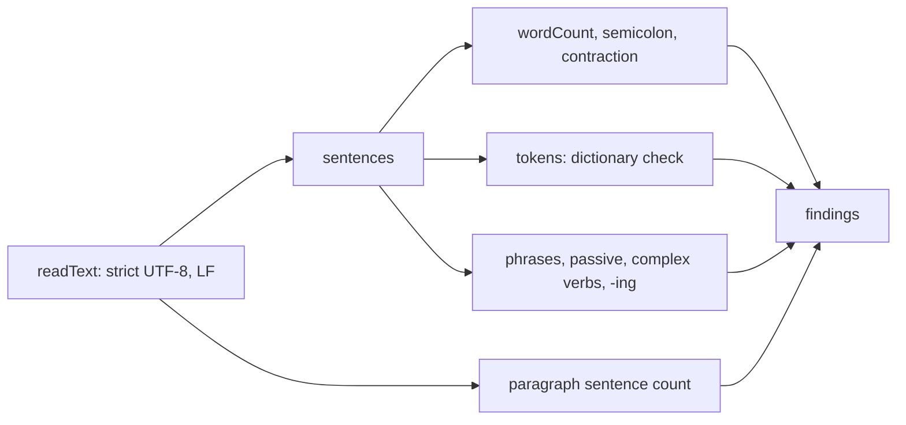

# Pack linter

## Purpose

The pack contains a small linter, so a person or an agent can check text against the pack without Anchored Docs. The linter finds the mechanical errors. The linter gives warnings for the rules that a person must examine. The kit copies `handwritten/ste_lint.mjs` into `pack/tools/` without a change.

## Entry points

- `node pack/tools/ste_lint.mjs FILE [--mode procedural|descriptive] [--json] [--allow FILE]` starts `main` in `handwritten/ste_lint.mjs`.
- Other code can start `lint` in `handwritten/ste_lint.mjs` with the text, the mode, a list of project words, and a dictionary from `load`.

## Sequence

## Key behavior

- `load` in `handwritten/ste_lint.mjs` reads `approved-words.json` and `unapproved-words.json` from the `dictionary` folder adjacent to `tools/`. `load` adds `s` and `es` to each approved noun.
- `lint` in `ste_lint.mjs` sets the sentence limit to 20 words in `procedural` mode and 25 words in `descriptive` mode.
- `sentences` in `ste_lint.mjs` counts inline code as 1 word and keeps only the text of a hyperlink. A colon ends a sentence, as rule 8.4 lets a colon do in a list.
- `lint` in `ste_lint.mjs` tries the word forms from `stems` for a word that is not approved. An unapproved word gives an error with the alternatives from the dictionary. A word that is not in the dictionary gives one warning for each file.
- Passive voice, complex verbs, and `-ing` forms give warnings. A semicolon, a contraction, a long sentence, or a paragraph with more than 6 sentences gives an error.
- `readText` in `ste_lint.mjs` reads the file as strict UTF-8 and changes each line end to LF. `readText` keeps a byte order mark as a character, as Python does.
- `main` in `ste_lint.mjs` sets exit code 1 when there is an error, and 0 when there is no error.

## Failure modes

- An incorrect command line: `parseArgs` in `ste_lint.mjs` stops, and `main` prints the correct form and sets exit code 2.
- A missing file, a file that is not UTF-8, or a pack without its `dictionary` folder: `main` in `ste_lint.mjs` prints 1 line. Then it sets exit code 1.

## Decisions

- [0002: Keep the output of the Python kit](../decisions/0002-keep-python-output.md)

## Source references

`handwritten/ste_lint.mjs` (`lint`, `load`, `sentences`, `wordCount`, `stems`, `readText`, `parseArgs`, `main`).
