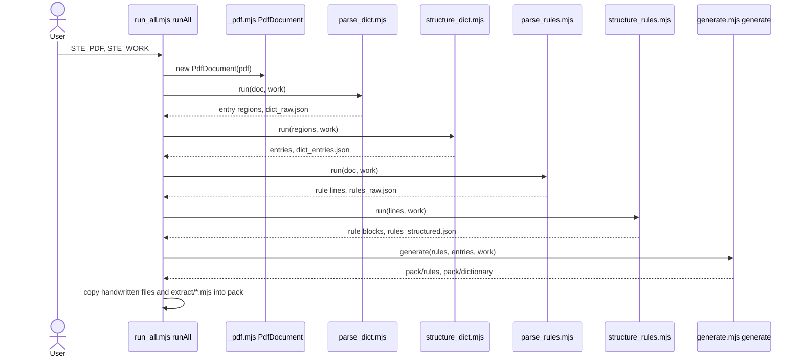

# Pack build

## Purpose

The pack build is the only flow that a person starts. It reads the PDF one time, sends the data through 5 stages, and writes the agent pack. Each stage also writes its intermediate file, so a person can find the stage that causes an incorrect result.

## Entry points

- `node run_all.mjs` starts the command-line code at the end of `run_all.mjs`. That code reads `STE_PDF` and `STE_WORK` and starts `runAll` in `run_all.mjs`.
- Tests and tools can start `runAll` in `run_all.mjs` directly with `pdf` and `work` paths.

## Sequence

## Key behavior

- `runAll` in `run_all.mjs` opens the PDF one time with `PdfDocument` and gives the same document to `parseDict` and `parseRules`.
- The stage order is always the same: `parseDict`, `structureDict`, `parseRules`, `structureRules`, then `generate`. Each stage module also has a `run` function that writes the intermediate file of the stage.
- `runAll` prints each line of the stage log with the stage name in front of it. The count lines are the values in the table of `INSTRUCTIONS.md`, section 4.
- After `generate`, `runAll` copies `README.md`, `enforcement-checklist.md`, `dictionary-conventions.md`, and `ste_lint.mjs` from `handwritten/` into the pack. It also copies each `.mjs` file of `extract/` into `pack/tools/extract/`.
- The command-line code of `run_all.mjs` finds a relative `STE_PDF` or `STE_WORK` from the kit folder `KIT`. Without `STE_WORK`, it uses `work` in the current folder. [Configuration](../configuration.md) gives the full rules.

## Failure modes

- No PDF at the path: `runAll` stops with `PDF not found`.
- Less pages than `LAST` in `parse_dict.mjs`: `runAll` stops before a stage starts, because Issue 9 has 434 pages.
- A part of the PDF format that `PdfDocument` or `pageObjects` cannot read: the reader stops with a message that names that part. See [PDF read](pdf-read.md).
- The command-line code of `run_all.mjs` catches each error, prints one line with `run_all:` in front, and sets exit code 1.

## Decisions

- [0001: Read the PDF with a small reader that uses only Node.js](../decisions/0001-zero-dependency-pdf-reader.md)
- [0002: Keep the output of the Python kit](../decisions/0002-keep-python-output.md)

## Source references

`run_all.mjs` (`runAll`, `KIT`), `extract/parse_dict.mjs`, `extract/structure_dict.mjs`, `extract/parse_rules.mjs`, `extract/structure_rules.mjs`, `extract/generate.mjs`, `handwritten/`.
