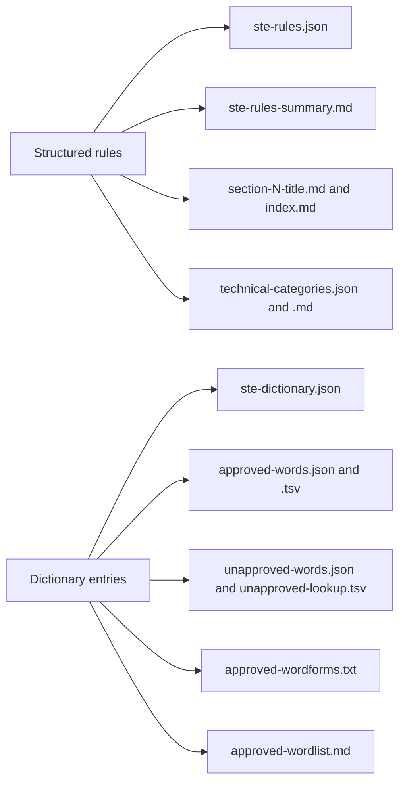

# Pack generation

## Purpose

Agents use the rules and the dictionary in different lengths and formats. The pack has a short summary for a system prompt, a file for each section, short word lists, and full JSON. This flow writes all of these files into `pack/rules/` and `pack/dictionary/`.

## Entry points

- `generate` in `extract/generate.mjs` gets the structured rules, the dictionary entries, and the work folder. `runAll` in `run_all.mjs` starts it as the last stage.

## Sequence

## Key behavior

- Each Markdown file that `generate` in `extract/generate.mjs` writes starts with `HDR`, a comment that names ASD as the copyright holder.
- `generate` in `generate.mjs` writes each section file with `mdBlocks`. A topic becomes a heading, a help block becomes a quote, and an example group becomes a table.
- `categories` in `extract/generate.mjs` reads rule `1.5` for the technical-noun categories and rule `1.12` for the technical-verb categories. A heading such as `1. Tools` starts a category. A paragraph gives its description, and each comma-separated item of a list block is an example.
- `generate` in `generate.mjs` writes `approved-words.json` and `unapproved-words.json` without examples. `ste-dictionary.json` keeps all of the data.
- `approved-wordforms.txt` has each approved headword and each listed form in lowercase. `generate` sorts the list by code point with `cmpCodePoint` from `extract/_py.mjs`.
- `dumps` in `extract/_py.mjs` writes JSON in the format of Python `json.dump`: the same indent, the same separator characters, and the same character codes. Thus the files are the same as the files from the Python kit.
- `py` in `extract/generate.mjs` writes `None` for a missing topic, as a Python f-string did.

## Failure modes

- `generate` in `generate.mjs` stops when it does not get rules, entries, and a work folder.
- `categories` in `generate.mjs` stops when rule `1.5` or rule `1.12` is not in the structured rules.

## Decisions

- [0002: Keep the output of the Python kit](../decisions/0002-keep-python-output.md)

## Source references

`extract/generate.mjs` (`generate`, `mdBlocks`, `categories`, `slug`, `py`, `HDR`), `extract/_py.mjs` (`dumps`, `cmpCodePoint`).
