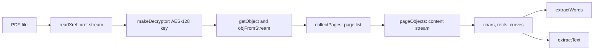

# PDF read

## Purpose

The extraction stages use the position, the font, and the font size of each word. They also use the thin rectangles between dictionary entries and the curves of the help icons. This flow gives them that data. The values are the same as the values that pdfplumber 0.11 gave to the Python kit, so the stages make the same decisions.

## Entry points

- `PdfDocument` in `extract/_pdf.mjs` opens the file and makes the page list.
- `pageObjects` in `extract/_layout.mjs` interprets one page and gives `chars`, `rects`, and `curves`.
- `extractWords` and `extractText` in `extract/_words.mjs` make words and page text from the `chars` of a page.

## Sequence

## Key behavior

- `readXref` on `PdfDocument` reads only xref streams. It follows `Prev` to read the previous sections.
- `makeDecryptor` in `extract/_pdf.mjs` makes the file key from an empty user password. It compares the result with the `U` value of the file before it decrypts an object.
- `getObject` on `PdfDocument` reads an object one time and keeps it in a cache. `objFromStream` reads the objects that sit in object streams.
- `applyFilters` in `extract/_pdf.mjs` decodes FlateDecode with `node:zlib` and removes PNG predictors with `pngUnpredict`.
- `pageObjects` in `extract/_layout.mjs` follows the arithmetic of pdfminer.six. The box of a character comes from the font width, the font size, and the `Descent` of the font descriptor.
- `makeFont` in `extract/_layout.mjs` uses the AFM widths in `AFM` from `extract/_pdf_tables.mjs` when `BaseFont` is `Helvetica`, as pdfminer does.
- `pageObjects` in `extract/_layout.mjs` puts a closed path with 4 square corners into `rects`. It puts each other painted path into `curves`. It ignores a path that is 1 line.
- `extractWords` in `extract/_words.mjs` puts characters in groups by font when the stage gives `fontname`. It then makes lines with the tolerance `TOL` = 3. It divides words at a space or at a gap of more than `TOL`.

## Text of a character

- `makeFont` in `extract/_layout.mjs` makes a `toUni` function for each font. That function gives the text of each character code.
- A simple font uses its ToUnicode table first. When the table has no entry for a code, the font uses `WIN_ANSI` from `extract/_pdf_tables.mjs`.
- A Type0 font uses only its ToUnicode table. Its character codes have 2 bytes.
- `parseToUnicode` in `extract/_layout.mjs` reads the `bfchar` and `bfrange` sections of a ToUnicode table. A `bfrange` with 1 destination increases the last bytes of that destination for each code in the range.
- `addUni` in `extract/_layout.mjs` decodes each destination as UTF-16BE. `addUni` keeps a space when the table also maps the same code to a no-break space, as pdfminer does.
- A code with no text gives the text `(cid:N)`, where N is the code. `pageObjects` in `extract/_layout.mjs` puts that text on the character, as pdfminer does.
- `parseToUnicode` in `_layout.mjs` stops with an error on a `cidchar` or `cidrange` section, and on a glyph name as a destination. Issue 9 uses none of them.

## pdfminer behavior that the reader keeps

The Python kit used these results, so `pageObjects` in `extract/_layout.mjs` keeps them:

- `Q` gives back all text values, and also the text matrix.
- After a Form XObject, the device matrix stays at the value from the form until the next `cm` or `Q`.
- The `"` operator sets the spaces but does not go to the next line.
- The box of a curve uses only the end points of each segment.

## Failure modes

These conditions stop the read with a message that names the part of the PDF format. Issue 9 does not use them.

- `readXref` on `PdfDocument`: a classic xref table.
- `makeDecryptor` in `extract/_pdf.mjs`: encryption that is not Standard V4 R4 with AESV2, or a file that has a user password.
- `applyFilters` in `extract/_pdf.mjs`: a filter other than FlateDecode.
- `makeFont` in `extract/_layout.mjs`: a font type or an encoding other than Type0 Identity-H, TrueType, or Type1 with WinAnsiEncoding.
- `pageObjects` in `extract/_layout.mjs`: a page with a `Rotate` value, or an inline image.
- `extractWords` in `extract/_words.mjs`: text that is not upright.

## Decisions

- [0001: Read the PDF with a small reader that uses only Node.js](../decisions/0001-zero-dependency-pdf-reader.md)
- [0002: Keep the output of the Python kit](../decisions/0002-keep-python-output.md)

## Source references

`extract/_pdf.mjs` (`PdfDocument`, `Parser`, `makeDecryptor`, `applyFilters`), `extract/_layout.mjs` (`pageObjects`, `makeFont`, `parseToUnicode`), `extract/_words.mjs` (`extractWords`, `extractText`), `extract/_pdf_tables.mjs` (`WIN_ANSI`, `AFM`, `LIGATURES`).
