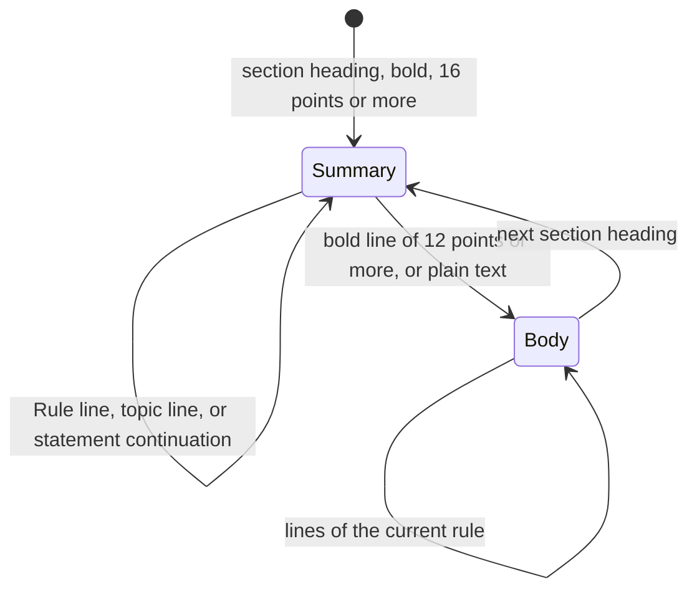

# Rules extraction

## Purpose

Part 1 of the specification has 9 sections. Each section starts with a summary page that lists the rule statements. Then each rule has a body with explanations, help notes, and pairs of examples. This flow reads the summary for the statements and the body for the blocks.

## Entry points

- `parseRules` in `extract/parse_rules.mjs` reads the pages from `FIRST` = 45 to `LAST` = 128. `run` in `parse_rules.mjs` writes `rules_raw.json`.
- `structureRules` in `extract/structure_rules.mjs` makes the blocks. `run` in `structure_rules.mjs` writes `rules_structured.json`.

## Sequence

## Key behavior

- `pageLines` in `extract/parse_rules.mjs` makes lines from words. `pageLines` gives each line an indent from the left edge of the page footer. It marks a line as `icon` when a help-icon curve is near it on the left.
- `parseRules` in `parse_rules.mjs` finds a section heading with `SECTION_RE` and a rule number with `RULE_RE`. The font size shows the type of rule line: 11 points in the summary, bold 12 points in the body.
- In the summary, a bold line sets the topic of the next statements. A line that starts with `-`, or that has more than 10 points more indent than the rule line, continues the last statement.
- In the body, a bold line of 13 points or more is a topic heading. A bold line of 12 points with more than 40 points of indent is a copy of the statement. `parseRules` in `parse_rules.mjs` does not keep it.
- Lines before the first rule of a section go into `section_intro` for that section.
- `parseRules` in `parse_rules.mjs` does not use a page that has the text `Blank Page`.
- `toBlocks` in `extract/structure_rules.mjs` gives each line one of these types: `topic`, `examples`, `help`, `label`, `heading`, `para`, or `list`.
- `toBlocks` in `structure_rules.mjs` collects the `Non-STE:` and `STE:` lines that come one after the other into an example group. An indented `or` line starts a second STE example for the same pair. An indented line that starts with `(` is a note.

## Failure modes

- The log line `order ok: False` from `parseRules` in `parse_rules.mjs` tells that the rule bodies came in a different order from the summary.
- The log line `missing bodies` lists each rule that has a statement and no body.
- `structureRules` in `structure_rules.mjs` stops when it gets no `order` list from `parseRules`.

## Decisions

- [0002: Keep the output of the Python kit](../decisions/0002-keep-python-output.md)

## Source references

`extract/parse_rules.mjs` (`parseRules`, `pageLines`, `slim`, `RULE_RE`, `SECTION_RE`), `extract/structure_rules.mjs` (`structureRules`, `toBlocks`, `EX_RE`).
