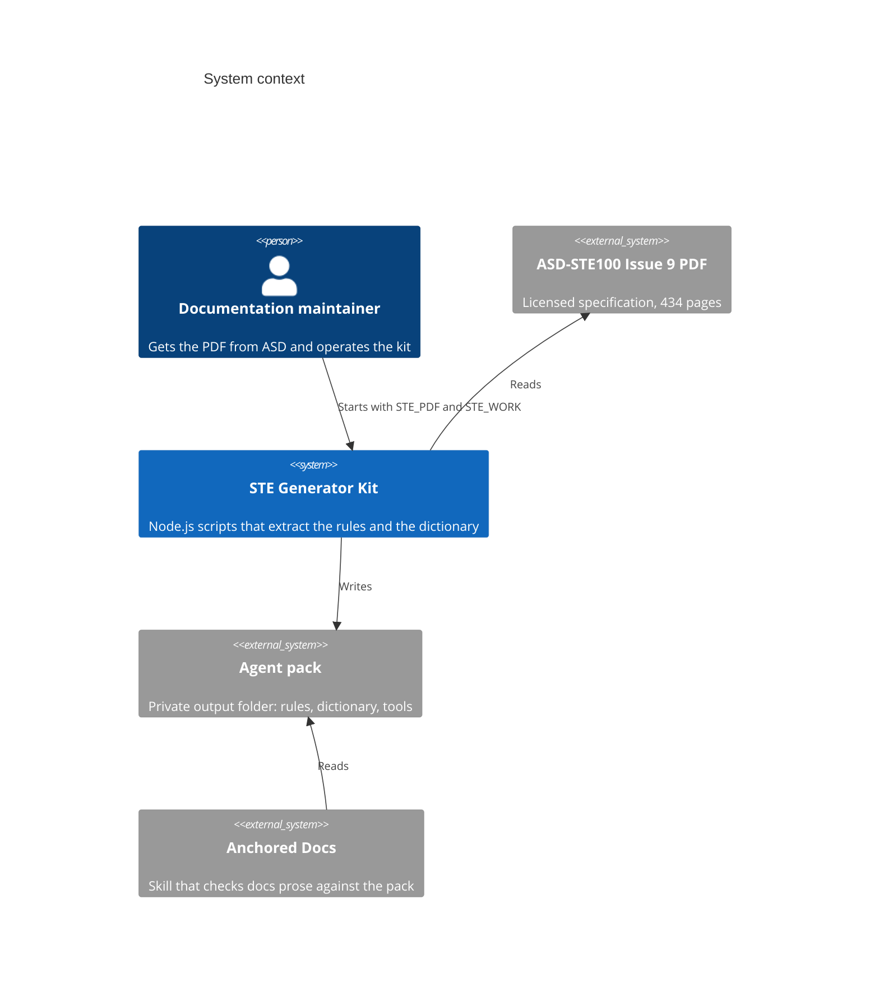

# Overview

## What this system is

The kit reads a licensed copy of the ASD-STE100 Issue 9 PDF. It writes the agent pack: rule files, dictionary files, and a linter that agents use to write and check Simplified Technical English. The kit contains no text from the specification. Each user makes a private pack from the PDF that they got from ASD.

## Who uses it

- A person who writes technical documentation operates the kit one time for each issue of the specification.
- The Anchored Docs skill reads the pack through `STE_AGENT_PACK` or from its own `references/asd-ste100-agent-pack/` folder.
- Agents and persons read the pack files directly, or use the pack linter `ste_lint.mjs`.

## System context

## Boundaries

In scope: the extraction of Part 1 (writing rules) and Part 2 (dictionary) from Issue 9, the files of the pack, and the pack linter.

Out of scope:

- The PDF and the pack. ASD has the copyright of their content, so the repository must not contain them. The `.gitignore` file tells Git to ignore them.
- Other issues of the specification. The page ranges and layout values in `parse_dict.mjs` and `parse_rules.mjs` apply to Issue 9 only.
- The check of documentation. Anchored Docs does that work with its own `ste_check.mjs`.

## Where to go next

- [Architecture](architecture.md) for the internal shape.
- [Flows](flows/index.md) for end-to-end behavior.
- [Configuration](configuration.md) for the two environment values.
